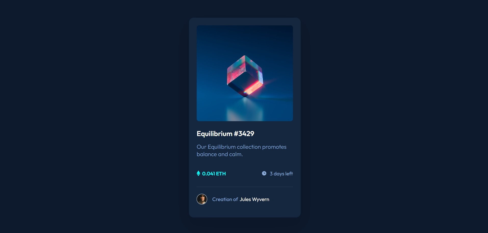
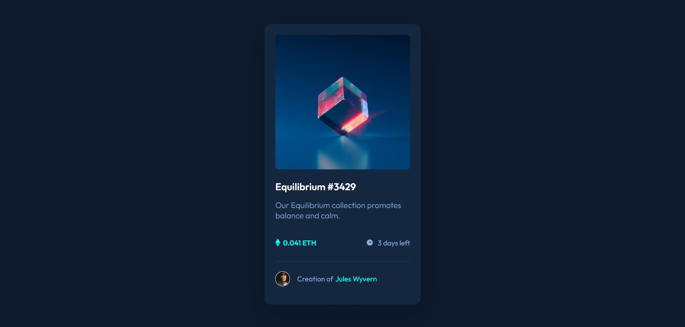
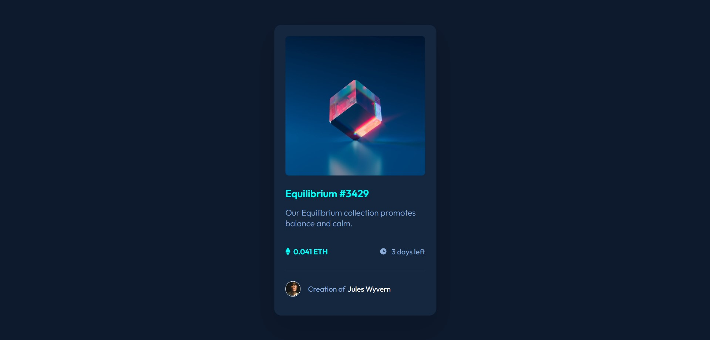
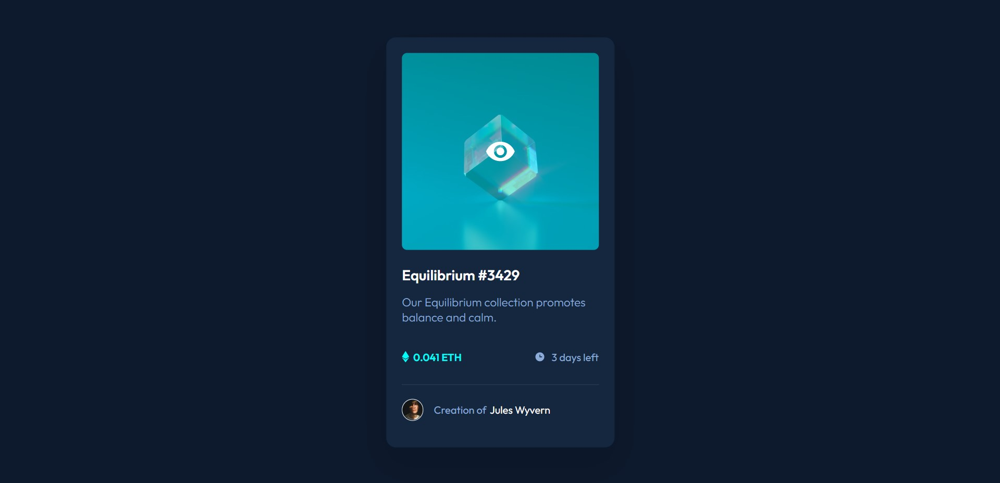

# nftcard
Created with CodeSandbox
# Frontend Mentor - NFT preview card component solution

This is a solution to the [NFT preview card component challenge on Frontend Mentor](https://www.frontendmentor.io/challenges/nft-preview-card-component-SbdUL_w0U). 

## Table of contents

- [Overview](#overview)
  - [The challenge](#the-challenge)
  - [Screenshot](#screenshot)
  - [Links](#links)
- [My process](#my-process)
  - [Built with](#built-with)
  - [What I learned](#what-i-learned)
  - [Continued development](#continued-development)
  - [Useful resources](#useful-resources)
- [Author](#author)
- [Acknowledgments](#acknowledgments)

## Overview

### The challenge

Users should be able to:

- View the optimal layout depending on their device's screen size
- See hover states for interactive elements

### Screenshot

### Links

- Solution URL: [Add solution URL here](https://github.com/EkaAbashidze/nftcard)
- Live Site URL: [Add live site URL here](https://ekaabashidze.github.io/nftcard/)

## My process

### Built with

- Semantic HTML5 markup
- CSS custom properties
- Flexbox
- Hover

### What I learned

In this project, it was new for me to combine different images and a container
in order to change the outlook when hovering over them. It was also the first time
I had to use different text in the same line and style them, and make one picture
small with a stroke around it (border-radius). I used div tag a lot of times, used class,
and tried to make the best out of the whole project. I tried my best to measure
pixels and make the card exactly as was shown in Figma design.

### Continued development

I can not say I was so comfortable with positions or flexbox, so that is probably what
I need to work on more.

### Useful resources

Mostly my mentors and different resources online helped me.

## Author

- Website - [Add your name here](https://github.com/EkaAbashidze)

## Acknowledgments

What I would like to emphasize is that even though the homework was somewhat
more than what we would have learned in the first lecture, it was exactly for
our, students' development and growth right away. I feel proud to create such a 
fine project one day after I have started learning, it is indeed a big challenge
and the credits go to the ones who created this great learning path for us.
I imagine that if it was expected from us to research and start gaining knowledge
and practical experience this fast, what wonderful things we can do in the nearest
future. So, Kudos to Bircamp community for bringing this to us!